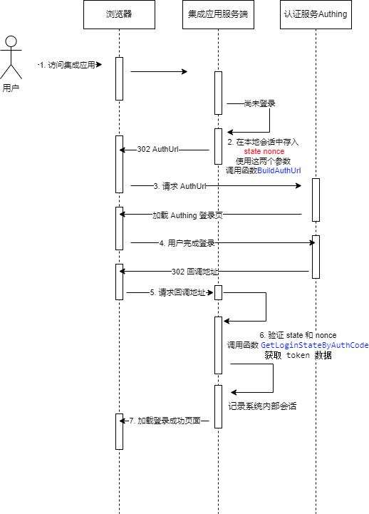

# Authing golang SDK 授权认证演示项目

本项目使用 fasthttp 作为演示项目，使用 [Gin](https://gin-gonic.com/) [Beego](https://beego.vip/) 等框架[iris](https://github.com/kataras/iris) 的使用流程类似。

golang SDK 中使用 OIDC 协议的授权码模式进行认证，其使用的时序图如下：

